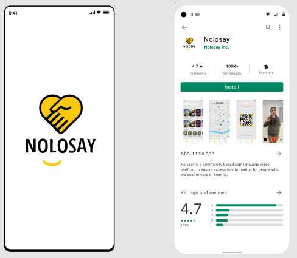

# README

#### Mobile application that will display the LSF traduction of the text in the different partner places.

[Key Features](./#key-features) • [How To Use](./#how-to-use) • [Download](./#download) • [Credits](./#credits) • [Related](./#related) • [License](./#license)



## Key Features

* Places to visit - accessibility everywhere
  * See different places around you and information about they're accessibility.
* Video creator
  * Film yourself, edit and post while helped by our intagrated assistant.
* See videos from other creators
  * Go to the place you like and watch videos from other content creators
* Earn points and advantages by making videos
  * By contributing, you can gain some advantages trough our different partners
  * More you are active, more you will be rewarded.

## How To Use

To clone and run this application, you'll need [Git](https://git-scm.com) and [Node.js](https://nodejs.org/en/download/) (which comes with [npm](http://npmjs.com)) installed on your computer. From your command line:

```bash
# Clone this repository
$ git clone https://github.com/NoLoSay/NoLoSayApp

# Install dependencies
$ npm install

# Run the app
$ npm start
```

> **Note** If you're using Linux Bash for Windows, [see this guide](https://www.howtogeek.com/261575/how-to-run-graphical-linux-desktop-applications-from-windows-10s-bash-shell/) or use `node` from the command prompt.

## Download

You can download the latest installable version of Nolosay on the [playstore](https://play.google.com/store/) or the [App store](https://www.apple.com/fr/app-store/).

## Docker

insérer doc docker

## Credits

This software uses the following packages:

* [Node.js](https://nodejs.org/)

## Related

* [Website](./) - Nolosay website.
* [Notion](./) - Nolosay notion.

## The NoloTeam

* Julien Lafargue [github](https://github.com/julienlafargue) - [linkedin](./)
* Alexandre Tomasin [github](https://github.com/Kubirt) - [linkedin](./)
* Quentin Camilleri [github](https://github.com/ZQUEMA) - [linkedin](./)
* Johan Chrillesen [github](https://github.com/JohanCDev) - [linkedin](./)
* Aurèle Nicolas [github](https://github.com/aurelenc) - [linkedin](./)
* Ugo Boulestreau [github](https://github.com/UgoBoulestreau) - [linkedin](./)
* Alexandre Laborde [github](https://github.com/alaborde29) - [linkedin](./)

## License
